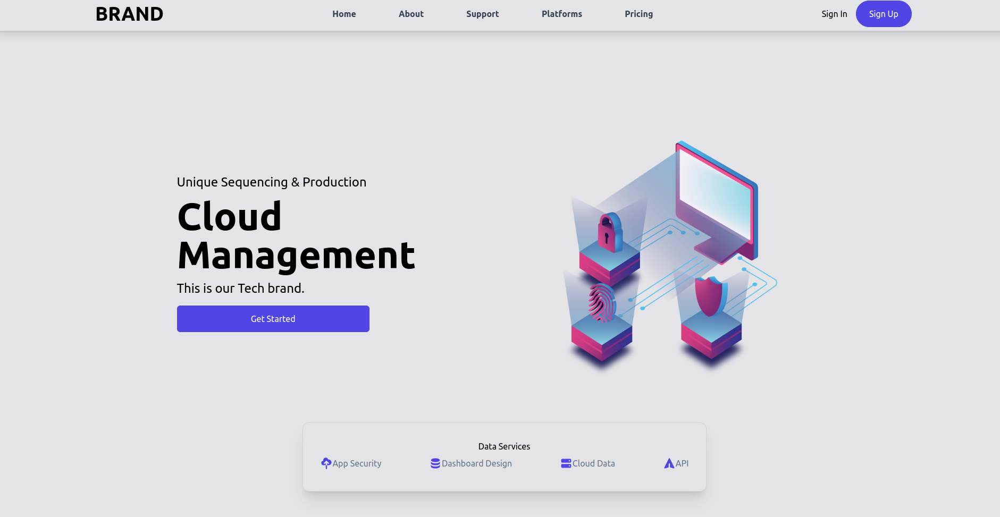
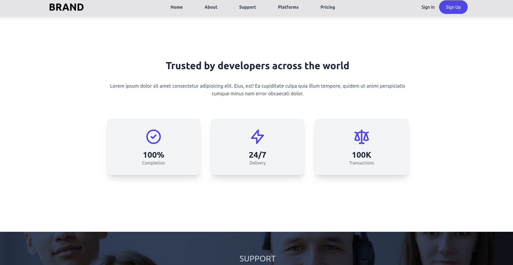
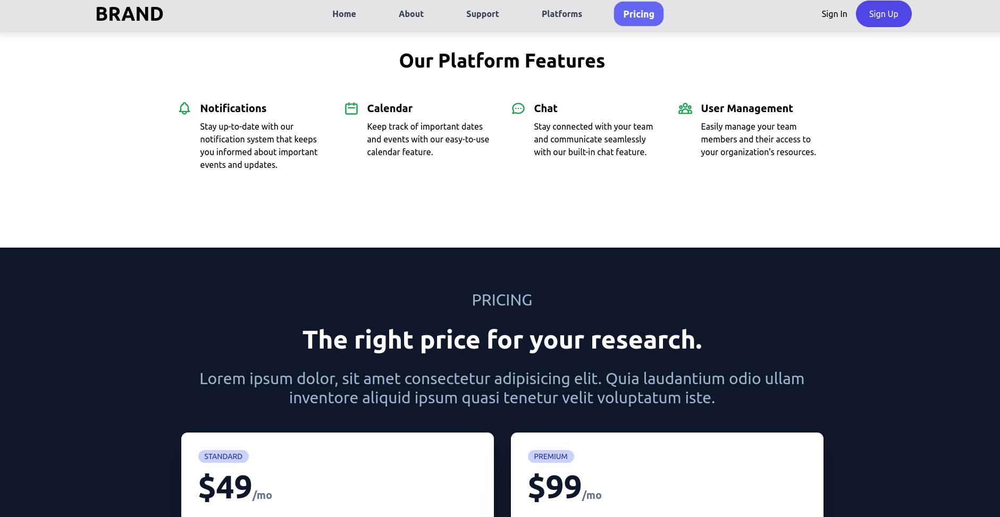
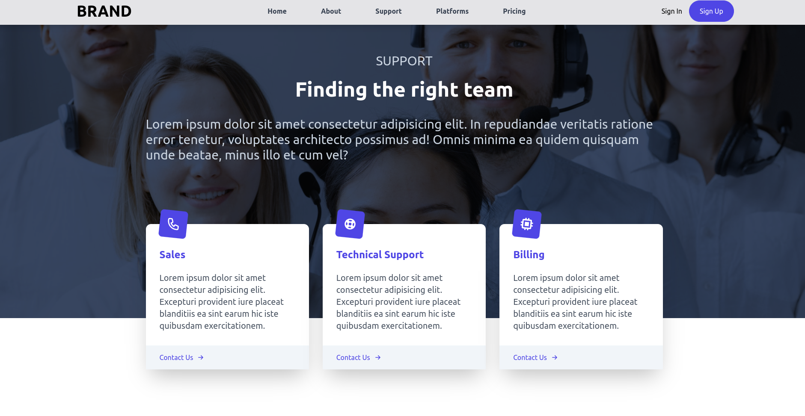

# Cloud Data Service - React Project

This project is a modern and responsive template for a cloud data service built with React, Tailwind CSS, Heroicons, React-Scroll, and React-Icons. The goal of this project is to provide a sleek and professional design for a cloud data service that offers various data management and analytics tools.

## Screenshots

Here are some screenshots of the project:





## Features

- Responsive and modern design
- Built with React and Tailwind CSS
- Uses Heroicons for icons
- Implements React-Scroll for smooth scrolling

## Installation

To install the project, follow these steps:

1. Clone the repository to your local machine using the following command:

```bash
git clone https://github.com/Moabbasi378/BestEats.git
```

2. Navigate to the project directory and install the dependencies:

```bash
cd cloud
npm install
```

3. Run the development server:

```bash
npm run start
```

4. Open your web browser and go to http://localhost:3000 to see the app running.

## Credits

This project was built using the following libraries and frameworks:

- React
- Tailwind CSS
- Heroicons
- React-Scroll
- React-Icons

## Contact

If you have any questions or feedback, please feel free to contact me at mohammadabbasi378@gmail.com.

You can also follow me on linkdin at [@moabbasi378](https://www.linkedin.com/in/mohammad-abbasi378/).
